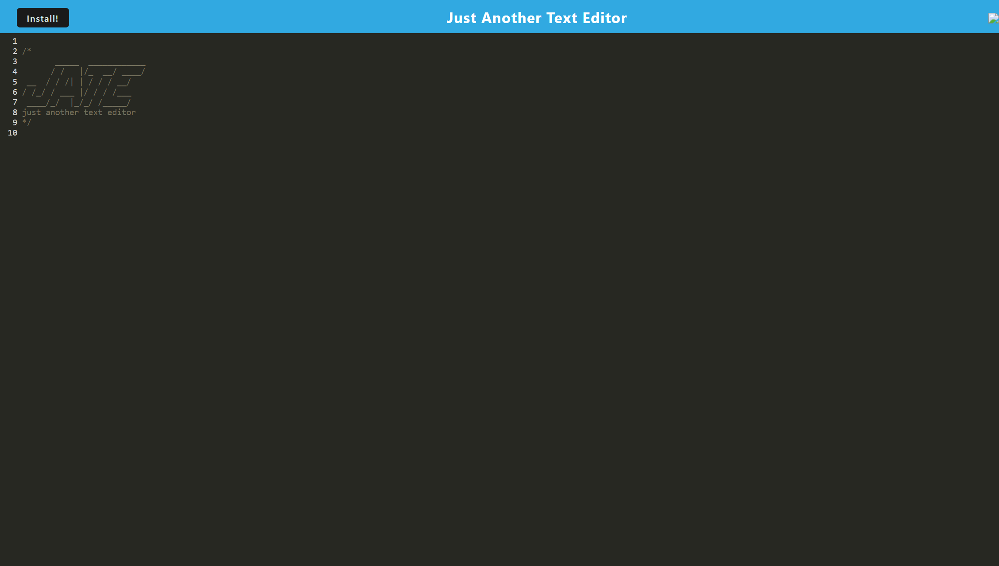

# Text Editor

## Description
Your task is to build a text editor that runs in the browser. The app will be a single-page application that meets the PWA criteria. Additionally, it will feature a number of data persistence techniques that serve as redundancy in case one of the options is not supported by the browser. The application will also function offline.

## Tablet of Contents
- [Installation](#installation)
- [Usage](#usage)
- [License](#license)
- [How to Contribute](#how-to-contribute)
- [Tests](#tests)
- [Questions](#questions)
- [Deployed Link](#deployed-link)

## Installation
a simple npm install after cloning the repo

## Usage
Run npm start to open the project in browswer. Users can then utilize the tool within the browser and download it to use offline.

## License
MIT License

## How to Contribute
contact me for access

## Tests
NA

## Questions
* Follow me on [GitHub](https://github.com/favalos06)
* Ask me questions at fernando.avalostorres91@gmail.com

## Deployed Link
https://limitless-reaches-68089.herokuapp.com/